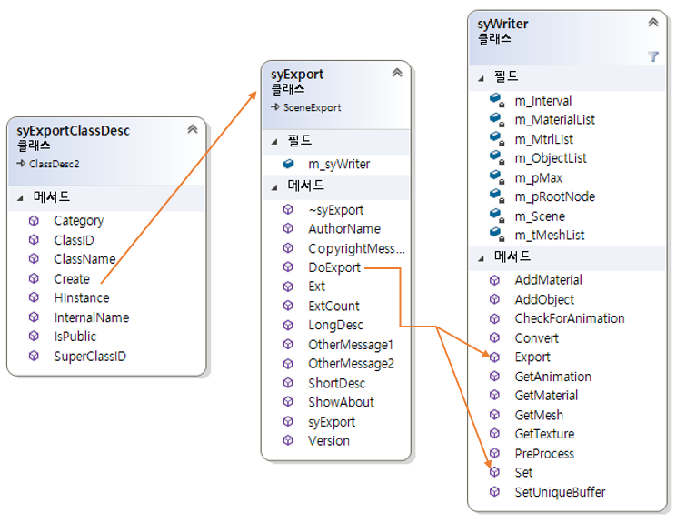

# DXMax


## 1. 소개
- 제목
  + 
- 제작 기간 
  + 2019. ~ 
  + 1인 프로젝트
  + VisualC++, DirectX11 이용
- 3D Max 파일 Exporter, Importer 제작

 ## 2. Exporter 구현내용


- dllmain.cpp의 LibClassDesc()에서 GetExportDesc()가 호출하여 syExportClassDesc 클래스를 생성
- 이후 Create()함수를 호출하여 할당된 객체(syExport)를 얻고 DoExport()를 실행

```C++
//Dllmain.cpp
__declspec(dllexport) ClassDesc* LibClassDesc(int i)
{
	switch (i) {
	case 0: return GetExportDesc();
	default: return 0;
	}
}

```

```C++
ClassDesc2* GetExportDesc()
{
	static syExportClassDesc syExportDesc;
	return &syExportDesc;
}

```

```C++
//class syExportClassDesc : public ClassDesc2
virtual void* Create(BOOL /*loading = FALSE*/) 
	{  
		return new syExport();
	}

```

```C++
//class syExport : public SceneExport
int	DoExport(const MCHAR *name, ExpInterface *ei, Interface *i, BOOL suppressPrompts, DWORD options )
{
	m_syWriter.Set(name, i);
	m_syWriter.Export();
	return true;
}

```
- DoExport()에서는 파생함수들을 호출
- Set() 함수는 Max에서 넘겨받은 오브젝트의 노드를 순회하여 필요한 정보를 뽑아냄 
- Export() 함수는 정보를 파일로 출력

