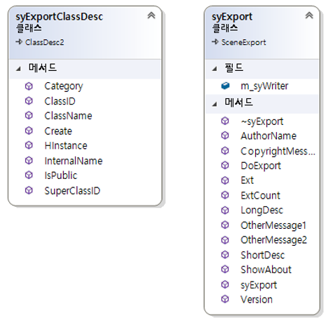

# DXMax


## 1. 소개
- 제목
- 제작 기간 
  + 2019. ~ 
  + 1인 프로젝트
  + VisualC++, DirectX11 이용
- 구현 내용
	+ 맥스 유틸리티 플러그인 : 맥스 화면에 대화상자 부착하여 원하는 작업 실행
	+ 제작 도구	: 캐릭터 스튜디오, 스킨 모디파이어 지원
	+ Mesh 단위의 선택적 출력 : Mesh의 교체 가능케 함
	+ 캐릭터 애니메이션 : 스키닝 방식을 오브젝트 애니메이션 방식으로 출력함


 ## 2. Exporter 구현내용
### 2.1 전체적인 

- dllmain.cpp의 LibClassDesc()에서 GetExportDesc()가 호출하여 syExportClassDesc 클래스를 생성
- 이후 Create()함수를 호출하여 할당된 객체(syExport)를 얻고 DoExport()를 실행

```C++
//Dllmain.cpp
__declspec(dllexport) ClassDesc* LibClassDesc(int i)
{
	switch (i) {
	case 0: return GetExportDesc();
	default: return 0;
	}
}

```

```C++
ClassDesc2* GetExportDesc()
{
	static syExportClassDesc syExportDesc;
	return &syExportDesc;
}

```

```C++
//class syExportClassDesc : public ClassDesc2
virtual void* Create(BOOL /*loading = FALSE*/) 
	{  
		return new syExport();
	}

```

```C++
//class syExport : public SceneExport
int	DoExport(const MCHAR *name, ExpInterface *ei, Interface *i, BOOL suppressPrompts, DWORD options )
{
	m_syWriter.Set(name, i);
	m_syWriter.Export();
	return true;
}

```
- DoExport()에서는 파생함수들을 호출
- Set() 함수는 Max에서 넘겨받은 오브젝트의 노드를 순회하여 필요한 정보를 뽑아냄 
- Export() 함수는 정보를 파일로 출력

### 2.2 Dllmain.cpp

- dllmain.cpp에서 응용프로그램의 진입점을 정의
- 3D MAX가 플러그인을 엑세스하여 동작시키고 유지시키기 위한 규칙을 이룬다. 
- DLL 작성시 반드시 외부로 노출시켜야 하는 함수들 지정한다.
	> LibDescription() : Dll 대신 제공하는 스트링 리턴(syExport100)
	
	> LibNumberClasses() : 플러그인 클래스의 수를 리턴(1개)
	
	> LibClassDesc() : 플러그인 속성과 메모리 내 클래스 인스턴트 할당 (return GetExportDesc();)
	
	> LibVersion() : 플러그인의 dll버전 관리에 사용(VERSION_3DSMAX)


- 외부로 공개하는 함수들은 플러그인의 정상 작동을 위해 Source.def에 나열해주어야 한다. 
```
LIBRARY syExport.dle
EXPORTS
   LibDescription        @1       PRIVATE
   LibNumberClasses    @2       PRIVATE
   LibClassDesc         @3       PRIVATE
   LibVersion           @4       PRIVATE
   LibInitialize          @6       PRIVATE
   LibShutdown         @7       PRIVATE
SECTIONS
   .data READ WRITE
```

### 2.3 syExport.cpp
#### 2.3.1 syExportClassDesc

- 플러그인 클래스를 생성하고 플러그인의 윈도우 인스턴스 핸들 및 고유한 클래스 ID를 관리
- Max SDK가 돌아가는 기본 파이프라인이 된다.

- 플러그인 오브젝트의 인스턴스 할당
```C++
virtual void* Create(BOOL /*loading = FALSE*/) 
return new syExport();
```
- 객체 타입의 분류(super class ID, class ID)
```C++
virtual SClass_ID SuperClassID() 
 return SCENE_EXPORT_CLASS_ID;		//플러그인 오브젝트가 SCENE EXPORT CLASS를 상속받았음을 명시
 ```
 ```C++
virtual Class_ID ClassID() 
 return syExport_CLASS_ID;	//맥스 플러그인의 고유한 아이디를 만들어냄. 유틸리티(gencid.exe)로 발급 받아야 함.
```
#### 2.3.2 syExport 
- 파일 출력에 대한 전반적인 정보를 담음

### 2.4 INode
- 맥스에서 작업한 모든 정보는 INode 클래스를 부모로 하여 Scene Graph의 구조로 저장 및 관리되는 일종의 N트리 구조
	> 최상위 트리를 얻어서 자식 트리를 순회하면 모든 작업 상태를 파악할 수 있다
	
	> 씬 그래프를 순회하며 SuperClassId() 및 ClassID()로 원하는 노드를 탐색하여 해당 정보를 얻으면 된다.
		> SuperClassID의 종류
		
			- GEOMOBJECT_CLASS_ID
			
			- CAMERA_CLASS_ID
			
			- LIGHT_CLASS_ID
			
			- SHAPE_CLASS_ID
			
			- HELPER_CLASS_ID
			
- 이 중 GeomeObject와 HelperObject만을 찾아서 정보를 추출했다.

### 2.5 syWrite
- root Node부터 Child Node까지 전체를 순회하며 랜더링 하는데 필요한 정보를 추출하고 출력
- Set -> Preprocess -> Convert -> Export 로 기동한다
	> Set
		- Max 인터페이스 설정
		- 최상단 노드 찾기
		- Interval정보 이용하여 Scene 정보 추출
		- root Node 밑의 모든 child Node를 재귀적으로 호출
	> PreProcess()
		- AddObject() : SuperClassID를 이용하여 GeomObject와 HelperObject의 경우만 ObjectList 추가 
		- AddMaterial() : 중복 제거하여 MaterialList에 추가
	> Convert()
		- parent Node 정보 추가
		- World Transform Matrix 추가
		- Animation 행렬 추가
		- MeshList 작성
	> Export()
		- Scene 정보 출력
		- Material 정보 
		- Mesh 정보
		- (v_world )= ∑_(i=0)^1▒〖(v_local )*M*1.0f〗
