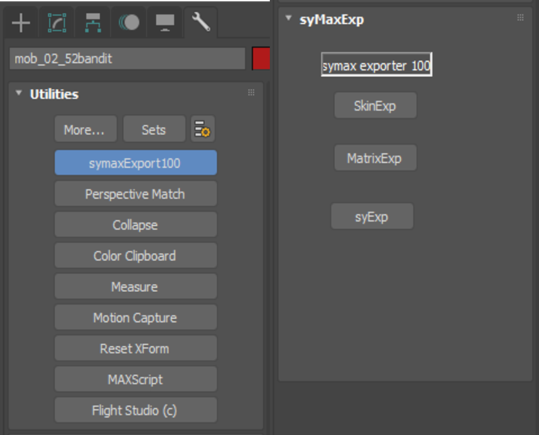
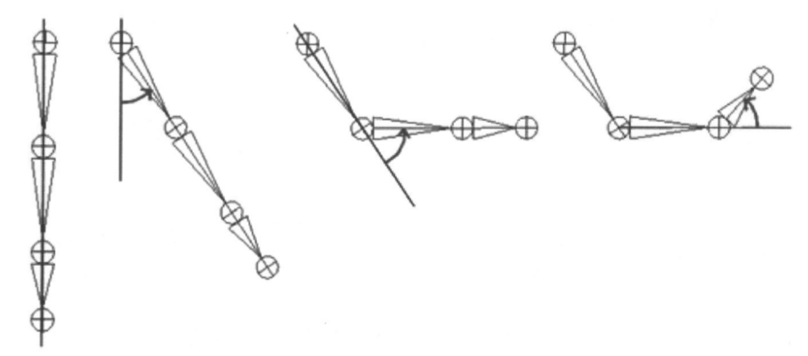
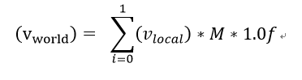
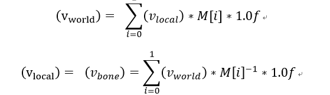
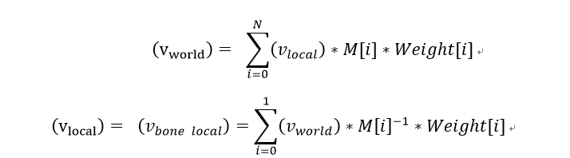
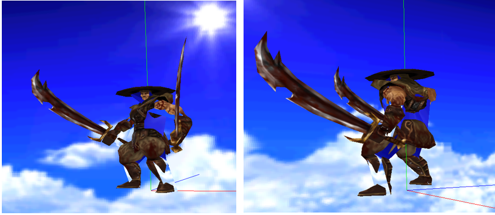
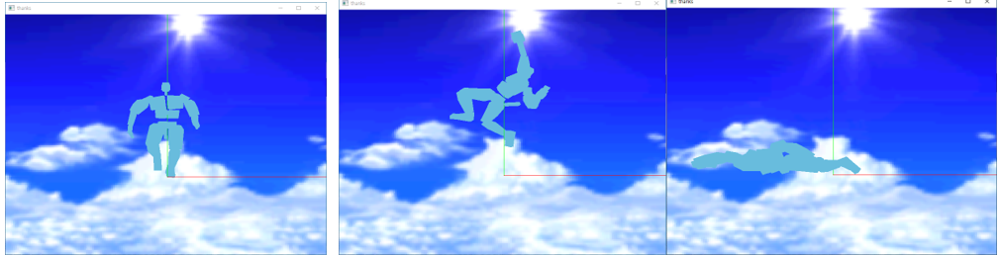
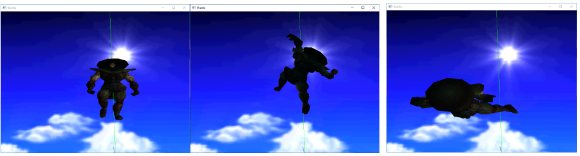
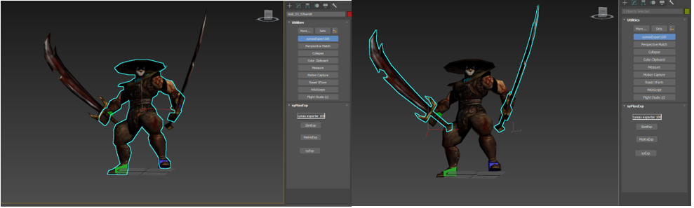

# DXMax




## 1. 소개
- 제목
- 제작 기간 
  + 2019. ~ 
  + 1인 프로젝트
  + VisualC++, DirectX11 이용
- 구현 내용
	+ 맥스 유틸리티 플러그인 : 맥스 화면에 대화상자 부착하여 원하는 작업 실행
	+ 제작 도구	: 캐릭터 스튜디오, 스킨 모디파이어 지원
	+ Mesh 단위의 선택적 출력 : Mesh의 교체 가능케 함
	+ 캐릭터 애니메이션 : 스키닝 방식을 오브젝트 애니메이션 방식으로 출력함


 ## 2. Exporter 구현내용
### 2.1 유틸리티 플러그인
- 편의성을 위해 맥스 회면에 대화상자를 부착하였다. 오브젝트를 선택한 뒤 버튼을 클릭하면 원하는 정보만 출력 할 수 있다. 
- 제작 도구
	- Physique : 캐릭터 스튜디오
	- Skin Modifier : 스킨 모디파이어
		> 캐릭터 애니메이션을 스키닝 방식으로 제작 시 mesh마다 가중치 정보가 있기 때문에 GeomObject에 애니메이션 트랙 정보가 남지 않음
		> 따라서 mesh와 애니메이션 행렬 정보를 분리하여 출력한다.
### 2.2 스키닝 애니메이션

#### 2.2.1 골격 구조

오브젝트의 움직임은 주로 골격 구조를 따른다. 예를 들어 팔은 위팔과 팔뚝, 손으로 나뉜다. 손은 손목 관절을 중심으로 독자적으로 회전하지만 팔뚝이 팔꿈치 관절을 통해 회전하면 손도 반드시 그에 따라 움직여야 한다. 즉 손의 애니메이션은 자신 뿐 아니라 부모(팔뚝 – 상반신... 등) 애니메이션의 영향을 받는다.

#### 2.2.2 정점 블랜딩
	- 애니메이션 방식에 따라 정점마다 애니메이션 행렬을 적용하는 방법이 다르다.
##### 1. 오브젝트 애니메이션 



단일 메쉬에 포함된 모든 정점들에 동일한 애니메이션 행렬 적용한다.

##### 2. 캐릭터 애니메이션
1개의 정점에 1개 이상의 애니메이션 행렬이 각각 가중치를 가지고 적용된다. 피부는 탄력성을 가지고 있으며 관절의 회전에 따라 피부의 늘어나는 비율이 다르다. 따라서 정점마다 서로 다른 애니메이션 행렬의 영향을 받는다.

###### A. 논블랜딩 방식


정점은 오직 본 한 개의 영향을 받는다. 따라서 애니메이션 시 본과 본이 연결되는 관절 부위가 자연스럽지 않게 각져보인다.

###### B. 블랜딩 방식


블랜딩 방식으로는 정점당 여러 개의 애니메이션 행렬에 다른 가중치로 영향을 받는다. 따라서 관절 부위처럼 여러 개의 본의 영향을 받는 부위도 자연스럽게 표현할 수 있다. 

Skin Modifier 방식으로 제작한 오브젝트는 블랜딩 방식으로만 정보가 export 되며 Physique modifier 방식으로 제작한 경우 블랜딩 여부를 구별하여 정보를 얻을 수 있다. sySkinExp.cpp에서는  통일성을 위해 논블랜딩 방식 역시 Weight = 1.0f인 블랜딩 방식으로 처리하였다.

###### C. 캐릭터 애니메이션
캐릭터 애니메이션은 mesh와 애니메이션 행렬 정보를 분리하여 출력한다. 왜냐하면 Physique 및 Skin Modifier를 이용해 캐릭터를 제작하면 본, 더미, 바이패드에만 애니메이션 정보가 출력되고 GeomObject에는 애니메이션 트랙 정보가 존재하지 않는다. 각 정점은 별개의 애니메이션 정보를 가지고 있지 않는다. 대신 어떤 본에서 얼마의 가중치로 영향을 받는지에 대한 정보만을 가지고 있다. 그러므로 mesh 정보를 가진 GeomObject는 \*.skm파일로 따로 출력하고 애니메이션 정보를 가진 나머지 정보는 \*.matrix파일로 따로 출력한다.



▲오브젝트 애니메이션 방식으로 출력한 파일. 오직 GeomObject만 출력하고 전체가 하나의 행렬에만 영향을 받기 때문에 애니메이션이 적용되지 않으며 출력되지 않는 부분이 많다.



▲캐릭터 애니메이션 방식으로 출력했을 때 (바이패드) - 오직 애니메이션 정보만을 가지고 있다.



▲캐릭터 애니메이션 방식으로 출력한 파일

###### D. 매쉬 단위의 선택적 출력



단일 mesh로 구성된 캐릭터와 다르게 신체 부분별로 별개의 mesh를 가지고 있기 때문에 해당 부위의 mesh를 교체할 수 있다. (캐릭터 커스터마이징 가능)
맥스 유틸리티 플로그인에 오브젝트만을 선택하여 별도의 파일로 익스포트 하는 기능을 추가하였다.
#### 2.2.3 매쉬 파일 출력

+ 굵은 표시는 출력한 정보
+ Struct syScene 
	- int   **iFirstFrame** : 시작 프레임
	- int   **iLastFrame** : 마지막 프레임
	- int   **iFrameSpeed** : 1초당 프레임 개수
	- int  **iTickPerFrame** : 1프레임의 틱 값
	- int   **iNumObjects** : Mesh Object 개수
	- int   **iNumMaterials** : Mtrl Object 개수

+ Struct syMtrl
	- INode  pINode	
	- int   **iMtrlID** : 텍스쳐 넘버
	- TSTR  **szName** : 텍스쳐 이름
	- vector <syTexMap\> texList : 텍스쳐 리스트
		- TSTR **name 텍스쳐 이름
		- int iMapID : 텍스쳐 타입 인덱스
	- vector <syMtrl\>    subMtrl : subMtrl 리스트
		- int **iMtrlID** : 텍스쳐 넘버
		- TSTR **szName** : 텍스쳐 이름
+ Struct syMesh
	- INode  pINode;	
	- int iSubMesh : 버퍼 리스트의 크기
	- TSTR    **name** : 노드의 이름
	- TSTR    **ParentName**: 노드의 부모 이름
	- D3D_MATRIX **matWorld** : 노드의 월드 행렬
	- vector<TriList\> triList : 완성된 트라이앵글
	- vector<vectorTriList\> bufferList : 트라이앵글 리스트
	- vector<syBipedVertex\> bipedList : 바이패드 리스트
	- vector<BvertexList\>   **vbList** : vertex buffer 리스트
	- vector<IndexList\>    **ibList** : Index buffer 리스트
	- bool  **bAnimatin[3]** : 위치/회전/신축 애니메이션 여부
	- vector<syAnimTrack\>   **animPos** : 위치 애니메이션
	- vector<syAnimTrack\>   **animRot** : 회전 애니메이션
	- vector<syAnimTrack\>   **animScl** : 신축 애니메이션
	- int     **iMtrlID** : 텍스쳐 넘버

- ObjectRef의 SuperclassID를 찾아서 어떤 인터페이스를 통해 오브젝트를 작성했는지 구별
- Physique를 사용한 경우 블랜딩 방식을 사용했는지, 논블랜딩 방식을 사용했는지에 따라 다르게 출력
- 논블랜딩을 사용한 경우 정점당 애니메이션 행렬 1개만 이용해 계산한다는 점에서 가중치가 1이고 행렬도 1개인 블랜딩 방식과 동일하게 출력
- Skin Modifier를 사용하는 경우 모두 블랜딩 방식으로만 출력된다.
```C++
void  sySkinExp::SetBippedInfo(INode* pNode, syBMesh& tMesh)
{
	//애니메이션 제작 도구
	Modifier* phyMod = FindModifier(pNode, Class_ID(PHYSIQUE_CLASS_ID_A, PHYSIQUE_CLASS_ID_B));
	Modifier* skinMod = FindModifier(pNode, SKIN_CLASSID);
	if (phyMod)
	{
		ExportPhysiqueData(pNode, phyMod, tMesh);
	}
	else if (skinMod)
	{
		ExportSkinData(pNode, skinMod, tMesh);
	}
}

```

### 2.2.3 바인드 포즈 애니메이션

애니메이션을 적용한다면 매 씬에서 vertex정보는 달라진다. 모든 씬에서 vertex정보를 출력할 수는 없으므로 첫 번째 씬의 vertex만 vbList에 넣을 것이다. 그렇다면 mesh 정보에는 애니메이션이 적용되지 않는다. 그리고 애니메이션 정보는 bone좌표계에서 계산하여 출력할 것이다. 그리고 mesh의 vertex를 본좌표계로 바꾸어서 계산을 할 것이다.

Animation World Vertex

(bind pose)	$Object World Vertex * (Skin Space BoneTM)^(-1)*Bone Animation Matrix$

(일반적으로)     $Object World Vertex * (BoneTM)^(-1)*Bone Animation Matrix$


하지만 mesh의 수백개의 vertex를 매 프레임 본좌표계로 변환하는 것은 계산 양이 너무 많다. 따라서 행렬의 곱에는 결합 법칙이 성립한다는 것을 이용해 계산식을 이렇게 바꾸었다.

$Object World Vertex * {(Skin Space BoneTM)^(-1)*Bone Animation Matrix}$

프레임마다 월드 좌표로 출력된 mesh를 본좌표계로 되돌려주는 행렬은 애니메이션 행렬 앞에 곱해줄 것이다. 애니메이션 행렬은 바이패드 개수만큼 있기 때문에 수백 수천개의 vertex에 일일히 곱해주는 것보다 바이패드 수(최대 255개)만큼만 곱해주는 것이 계산 속도를 훨씬 향상시킬 수 있다.
드레스 포즈에서 스킨파일(\*.skm)을 출력하였고 바이패드의 동작을 별개로(\*.matrix) 출력하였다. skm파일은 월드 정점 상태로 export하여 추가적인 행렬 없이 랜더링 할 수 있으며 바이패드 애니메이션에 적용하기 위해 스킨 공간에서 모든 바이패드 행렬(Skin Space BoneTM)을 출력해야만 한다. Matrix 파일 역시 랜더링시 애니메이션 적용 전 후 과정을 시각적으로 볼 수 있어 애니메이션 구조를 이해하기 용이하다.

```C++
bool sySkmObj::Frame(std::vector<D3DXMATRIX>		m_calList)
{
	ZeroMemory(&m_AniList, sizeof(CB_BoneAnim));
	for (int i = 0; i < m_calList.size(); i++)
	{
		
		m_AniList.g_pMatrix[i] = m_NodeTMList[i] * m_calList[i];	//(1)
		D3DXMatrixTranspose(&m_AniList.g_pMatrix[i], &m_AniList.g_pMatrix[i]);
	}
	return Frame();
};

```
- m_NodeTMList[i] : skm파일을 출력할 때 계산한 정보다. 
```Matrix3 wtm = Inverse(pNode->GetNodeTM(m_Interval.Start())); ```
- $NodeWorldTM = NodeLocalTM * ParentLocalTM$ (뼈좌표에서 월드 좌표로 변환)
- 노드마다 첫 번째 프레임의 TM행렬을 얻은 뒤 역행렬을 구해서 출력하였다. 이것은 월드좌표로 출력된 vertex를 뼈좌표로 되돌려주어서 뼈좌표 기준의 애니메이션 행렬과의 좌표계를 맞춰준다.
- m_calList[i] 는 syBoneObj에서 매 프레임 계산한 MeshList의 최종 월드 행렬이다. 본좌표계에서의 애니메이션 움직임을에 대한 정보를 담고 있다.

이렇게 계산한 m_AniList.g_pMatrix[i] 행렬은 뼈좌표계 애니메이션 행렬을 의미한다. 캐릭터의 쉐이더 파일에 넘어가서 각 정점별 가중치 값에 따라 다르게 곱해져 계산된다. 
```C++
VS_OUTPUT VS(VS_INPUT input)
{
	VS_OUTPUT pOut = (VS_OUTPUT)0;
	float4x4  matMatrix;

	float3 vNormal = input.n;
	float4 vLocal = float4(input.p, 1.0f);
	float4 vAnim;
	for (int ibiped = 0; ibiped < 8; ibiped++)
	{
		if (ibiped < 4)
		{
			uint iBone = input.i0[ibiped];
			float fWeight = input.w0[ibiped];
			matMatrix = g_matAnim[iBone];// FetchBoneTransform(iBone);
			vAnim += fWeight * mul(vLocal, matMatrix);
			pOut.n += fWeight * mul(vLocal, matMatrix);
		}
		else
		{
			uint iBone = input.i1[ibiped - 4];
			float fWeight = input.w1[ibiped - 4];
			matMatrix = g_matAnim[iBone];
			vAnim += fWeight * mul(vLocal, matMatrix);
			pOut.n += fWeight * mul(vLocal, matMatrix);
		}
	}

	// world
	pOut.p = mul(vAnim, g_matWorld);// local * g_matWorld;
	pOut.p = mul(pOut.p, g_matView);// world * g_matView;
	pOut.p = mul(pOut.p, g_matProj);// view * g_matWorld;	
	pOut.t = input.t;

	float3 vLight = float3(0.0f, -1.0f, 0.0f) * -1.0f;
	float fDot = max(0.0f, dot(vLight, input.n));
	float4 vColor = float4(fDot, fDot, fDot, 1.0f);
	pOut.r = vColor;
	pOut.c = input.c;

	return pOut;
}

```


```C++
bool sySkmObj::Frame(std::vector<D3DXMATRIX>		m_calList)
{
	ZeroMemory(&m_AniList, sizeof(CB_BoneAnim));
	for (int i = 0; i < m_calList.size(); i++)
	{
		
		m_AniList.g_pMatrix[i] = m_NodeTMList[i] * m_calList[i];	//(1)
		D3DXMatrixTranspose(&m_AniList.g_pMatrix[i], &m_AniList.g_pMatrix[i]);
	}
	return Frame();
};

```
앞의 코드에서 좌표계별 오브젝트가 어떻게 그려지는지 확인하기 위해 (1)의 코드를 바꾸어 보았다.
#### A. 월드 좌표계
```D3DXMatrixIdentity(&m_AniList.g_pMatrix[i]);```
- skm 파일만 출력
- 애니메이션 적용 안됨
- World Vertex = Object World Vertex
#### B. 왜곡된 좌표계
```m_AniList.g_pMatrix[i]= m_calList[i];```
- 월드 좌표계에 본 기준 애니메이션이 곱해진 상태. 좌표계가 서로 맞지 않아 vertex가 왜곡되어 출력된다.
- 애니메이션 적용 됨
-$ World Vertex = Object World Vertex * Bone Animation Matrix$
#### C. 본 좌표계
```m_AniList.g_pMatrix[i] = m_NodeTMList[i];```
- 본 좌표계
- $World Vertex= Object World Vertex * (Skin Space BoneTM)^(-1)$
- 애니메이션 적용


### 2.2.4 전체적인 흐름

- dllmain.cpp의 LibClassDesc()에서 GetExportDesc()가 호출하여 syExportClassDesc 클래스를 생성
- 이후 Create()함수를 호출하여 할당된 객체(syExport)를 얻고 DoExport()를 실행

```C++
//Dllmain.cpp
__declspec(dllexport) ClassDesc* LibClassDesc(int i)
{
	switch (i) {
	case 0: return GetExportDesc();
	default: return 0;
	}
}

```

```C++
ClassDesc2* GetExportDesc()
{
	static syExportClassDesc syExportDesc;
	return &syExportDesc;
}

```

```C++
//class syExportClassDesc : public ClassDesc2
virtual void* Create(BOOL /*loading = FALSE*/) 
	{  
		return new syExport();
	}

```

```C++
//class syExport : public SceneExport
int	DoExport(const MCHAR *name, ExpInterface *ei, Interface *i, BOOL suppressPrompts, DWORD options )
{
	m_syWriter.Set(name, i);
	m_syWriter.Export();
	return true;
}

```
- DoExport()에서는 파생함수들을 호출
- Set() 함수는 Max에서 넘겨받은 오브젝트의 노드를 순회하여 필요한 정보를 뽑아냄 
- Export() 함수는 정보를 파일로 출력

#### 2.2.4.1 Dllmain.cpp

- dllmain.cpp에서 응용프로그램의 진입점을 정의
- 3D MAX가 플러그인을 엑세스하여 동작시키고 유지시키기 위한 규칙을 이룬다. 
- DLL 작성시 반드시 외부로 노출시켜야 하는 함수들 지정한다.
	> LibDescription() : Dll 대신 제공하는 스트링 리턴(syExport100)
	
	> LibNumberClasses() : 플러그인 클래스의 수를 리턴(1개)
	
	> LibClassDesc() : 플러그인 속성과 메모리 내 클래스 인스턴트 할당 (return GetExportDesc();)
	
	> LibVersion() : 플러그인의 dll버전 관리에 사용(VERSION_3DSMAX)


- 외부로 공개하는 함수들은 플러그인의 정상 작동을 위해 Source.def에 나열해주어야 한다. 
```
LIBRARY syExport.dle
EXPORTS
   LibDescription        @1       PRIVATE
   LibNumberClasses    @2       PRIVATE
   LibClassDesc         @3       PRIVATE
   LibVersion           @4       PRIVATE
   LibInitialize          @6       PRIVATE
   LibShutdown         @7       PRIVATE
SECTIONS
   .data READ WRITE
```

#### 2.2.4.2 syExport.cpp
- 파일 출력에 대한 전반적인 정보를 담음

- syExportClassDesc

	+ 플러그인 클래스를 생성하고 플러그인의 윈도우 인스턴스 핸들 및 고유한 클래스 ID를 관리
	+ Max SDK가 돌아가는 기본 파이프라인이 된다.

	+ 플러그인 오브젝트의 인스턴스 할당
```C++
virtual void* Create(BOOL /*loading = FALSE*/) 
return new syExport();
```
	+ 객체 타입의 분류(super class ID, class ID)
```C++
virtual SClass_ID SuperClassID() 
 return SCENE_EXPORT_CLASS_ID;		//플러그인 오브젝트가 SCENE EXPORT CLASS를 상속받았음을 명시
 ```
 ```C++
virtual Class_ID ClassID() 
 return syExport_CLASS_ID;	//맥스 플러그인의 고유한 아이디를 만들어냄. 유틸리티(gencid.exe)로 발급 받아야 함.
```

#### 2.2.4.3 INode
- 맥스에서 작업한 모든 정보는 INode 클래스를 부모로 하여 Scene Graph의 구조로 저장 및 관리되는 일종의 N트리 구조
	> 최상위 트리를 얻어서 자식 트리를 순회하면 모든 작업 상태를 파악할 수 있다
	
	> 씬 그래프를 순회하며 SuperClassId() 및 ClassID()로 원하는 노드를 탐색하여 해당 정보를 얻으면 된다.
		> SuperClassID의 종류
		
			- GEOMOBJECT_CLASS_ID
			
			- CAMERA_CLASS_ID
			
			- LIGHT_CLASS_ID
			
			- SHAPE_CLASS_ID
			
			- HELPER_CLASS_ID
			
- 이 중 GeomeObject와 HelperObject만을 찾아서 정보를 추출했다.

#### 2.2.4.4 syWrite
- root Node부터 Child Node까지 전체를 순회하며 랜더링 하는데 필요한 정보를 추출하고 출력
- Set = Preprocess = Convert = Export 로 기동한다
	> Set
		- Max 인터페이스 설정
		
		- 최상단 노드 찾기
		
		- Interval정보 이용하여 Scene 정보 추출
		
		- root Node 밑의 모든 child Node를 재귀적으로 호출
		
		
	> PreProcess
		- AddObject : SuperClassID를 이용하여 GeomObject와 HelperObject의 경우만 ObjectList 추가 
		
		- AddMaterial : 중복 제거하여 MaterialList에 추가
		
		
	> Convert
		- parent Node 정보 추가
		
		- World Transform Matrix 추가
		
		- Animation 행렬 추가
		
		- MeshList 작성
		
		
	> Export
		- Scene 정보 출력
		
		- Material 정보 
		
		- Mesh 정보
		
	
